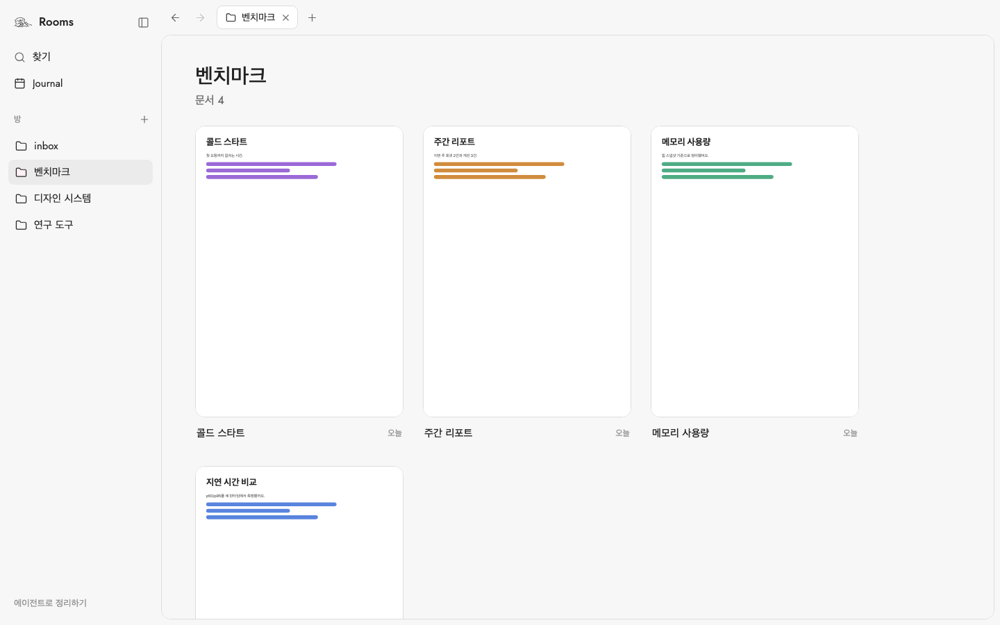

<h1 align="center">
  <picture>
    <source media="(prefers-color-scheme: dark)" srcset="assets/banner-dark.svg">
    
  </picture>
</h1>

Alto Rooms collects the HTML files your coding agents write and shows them in one place, sorted by topic.



## Why

Agents like Claude Code and Codex write specs, reports, and reviews as HTML. These files end up spread across repos and folders. Rooms gathers them into one place, where you can browse them.

## Concepts

- **Room**: a topic. One folder in `~/rooms`, or an existing folder you link.
- **Artifact**: one HTML file in a room. It can be a symlink to a file that lives elsewhere.
- **Journal**: one page per day. It shows the artifacts created that day, next to your own notes.

## How it works

- Write an `.html` file into a room folder. It shows up in the app within two seconds.
- Rooms never moves your files, and never writes into a folder you linked.
- Drag rooms in the sidebar to reorder them.

Rooms does not run agents or call any AI model. It only reads folders.

## Install

There is no prebuilt release yet. Build it from source on macOS.

Requirements: [Rust](https://rustup.rs) (stable) and [Bun](https://bun.sh).

```sh
git clone https://github.com/alto-computer/alto-rooms.git
cd alto-rooms
bun install
cd apps/desktop
bun run sidecar        # build the roomsd daemon
bun run tauri build    # build the app
```

Then copy `src-tauri/target/release/bundle/macos/Alto Rooms.app` to `/Applications`.

## Sort your existing files

Ask your agent:

```text
Read ~/rooms/ONBOARD.md and follow it.
```

The agent installs a small `rooms` skill. It then finds the HTML files you wrote in the last 14 days and links each one into a room. Your original files stay where they are.

## For agents

Write an HTML file into `~/rooms/<room>/`. That's all.

Optional `<meta>` tags:

| Tag | Use |
| --- | --- |
| `rooms:title` | Title shown on the card. Defaults to `<title>`, then the file name. |
| `rooms:created` | Creation time (ISO 8601). Defaults to when Rooms first sees the file. |
| `rooms:agent`, `rooms:session`, `rooms:cwd`, `rooms:machine` | Where the file came from. |

Rooms ignores hidden files, `node_modules`, `dist`, `build`, and anything listed in a `.roomsignore` file (same syntax as `.gitignore`).

## Plugins

Plugins add UI: a panel beside documents or a tab of their own. They run sandboxed and keep their data as files.

Two come with the app, on by default:

- [Goals](https://github.com/alto-computer/rooms-plugin-goals): long-, mid- and short-term goals and a TODO list, with documents linked to each.
- [Excalidraw notes](https://github.com/alto-computer/rooms-plugin-excalidraw): sketch beside any document; export as PNG.

Right-click a plugin in the sidebar to turn it off. To add another, copy its folder into `~/rooms/.rooms/plugins/`; Rooms asks before it runs. To write one, see [docs/plugins.md](docs/plugins.md).

## Shortcuts

| Key | Action |
| --- | --- |
| `⌘T` / `⌘W` | New tab / close tab |
| `⌘K` | Find a room or document |
| `⌘B` | Toggle the sidebar |
| `⌘[` / `⌘]`, `⌘←` / `⌘→` | Back / forward |
| `⌘`-click | Open in a new tab |

## Architecture

- **roomsd** (Rust) watches `~/rooms` and serves a local HTTP API on `127.0.0.1:4317`.
- **The desktop app** (Tauri + React) is one client of that API. You can build your own.
- `GET /v1/rooms` lists rooms. `GET /v1/events` streams changes. Write requests need the token in `~/rooms/.rooms/token`.

```text
crates/rooms-core       indexing, file watching, rooms, notes
crates/roomsd           HTTP API and event stream
crates/rooms-protocol   API types
packages/protocol-ts    TypeScript client
apps/desktop            Tauri app
```

## Develop

```sh
cd apps/desktop
bun run sidecar
bun run tauri dev      # run the app
bun run test           # unit tests
cargo test             # Rust tests (from the repo root)
```

## Status

This is an early version (0.3). It has been tested on macOS only.

## License

[MIT](LICENSE)
